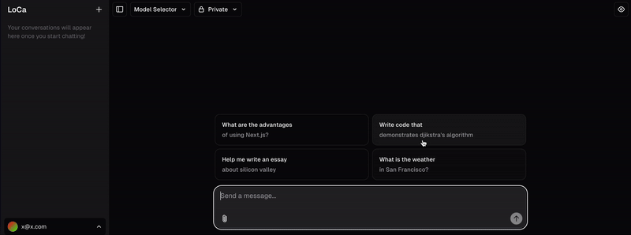

<h1 align="center">LoCa (Local Canvas)</h1>

<p align="center">
  An Open Source, completely local, OpenAI Canvas alternative.
</p>

<p align="center">
  <a href="#features"><strong>Features</strong></a> ·
  <a href="#model-providers"><strong>Model Providers</strong></a> ·
  <a href="#deploy-your-own"><strong>Hooks</strong></a> ·
  <a href="#running-locally"><strong>Running locally</strong></a> ·
  <a href="#development-plan"><strong>Development Plan</strong></a>
</p>
<br/>

## Disclaimer
Yes, this is heavily derived from the Vercel AI Template. Key differences being that the Supabase, Postgres, and other non-local bits have been torn out and replaced with local services. There are also a stream of minor improvements being made to the tools, ui and models.

## Why?
There is [OpenCanvas](https://github.com/langchain-ai/open-canvas) which is a LOT more competent than this implementation. While it is more featureful, it requires signup to ~5 different services before you can use it. LoCa just keeps your data in a simple SQLite database. Its up to you if you choose to use local or online models, it supports both.


## Features
- Talk / Code / Write 
  - Chat with your models in a familiar interface
  - Write documents and/or stories in a convenient document editor
  - Create code and run it immediately in the app using Pyiodide
- Use Any LLMs
  - Use Ollama models hosted locally, or services from Google, Groq, etc
  - Independently choose which model you want as your chatter, write and coder
- All data kept on-device
  - Data you create is stored immediately in a local SQLite database
  - You dont have to sign up for anything else (Supabase, LangSmith, etc)
- Email / Password Sign-in for multi-user local deployments

## Model Providers

For each of the core features in LoCa you can choose a model; in general I find that most people have a preferred model for each task rather than a one-size-fits-all approach.

Currently supports OpenAI, Google, Groq and Ollama. Super easy to add more though, poke around in `lib/ai/models.ts` to see how you can add more. 

## Running locally

You will need to use the environment variables [defined in `.env.example`](.env.example) to run LoCa. A `.env.local` file is all that is necessary, just make a copy of the example file and fill out the variables you want to use.

> Note: You should not commit your `.env` file or it will expose secrets that will allow others to control access to your various OpenAI and authentication provider accounts.
```bash
yarn/pnpm/npm install
yarn/pnpm/npm dev
```

Your app template should now be running on [localhost:3000](http://localhost:3000/).

## Development Plan

Current Priority:
- [ ] Blob File Uploads
  - Currently dependant on Vercel Blob, can be trivially converted to storing in SQLite or some other blob-like on-disk interface because this is local
- More Tools
  - [ ] Fetch Data From Web
  - [ ] Fetch Data From Document
    - Currently its only the whole document which can overwhelm smaller models
  - [ ] Piecewise document updates
